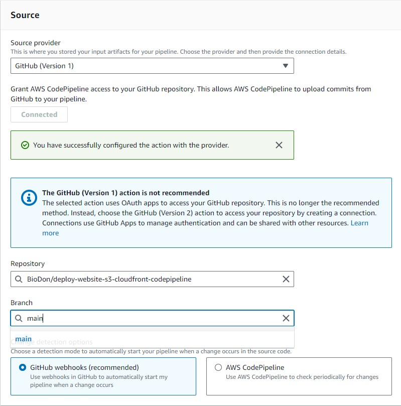

# Automate Deployment of a Static Website on AWS with CI/CD Using CodePipeline, S3 and CloudFront

### Introduction

In today's digital landscape, having a website that is not only dynamic but also scalable and reliable is crucial. Amazon Web Services (AWS) offers a robust infrastructure for hosting websites of any scale, and when combined with Continuous Integration/Continuous Deployment (CI/CD) pipelines, it becomes a powerful tool for automating deployment processes.

In this guide, we'll walk through the process of hosting a static website in AWS using two core services: Amazon S3 for storage and AWS CloudFront for content delivery. Additionally, we'll leverage AWS CodePipeline, a fully managed continuous integration and continuous delivery service, to automate the deployment process, ensuring that updates to our website are delivered seamlessly to users.

By following this step-by-step tutorial, you'll learn how to set up your own CI/CD pipeline, deploy a static website to AWS, and leverage the scalability and reliability of AWS infrastructure to ensure optimal performance for your website visitors.

Let's dive in and explore how to harness the power of AWS for hosting your static website with CI/CD automation.

### Application Architecture

When a user accesses your website by entering its DNS address into their web browser, the journey begins. The DNS service, in our case facilitated by Namecheap.com (though alternatives like Route 53 or GoDaddy.com are viable options), comes into play behind the scenes.

This DNS service is configured with a CNAME record that seamlessly redirects the user to our CloudFront Distribution. This distribution, a powerful Content Delivery Network (CDN) service provided by AWS, efficiently serves the static content stored in the S3 Bucket. This bucket houses essential files such as index.html and other front-end code.

Security is paramount in this architecture. The S3 bucket is exclusively accessed through CloudFront using an Origin Access Identity (OAI), ensuring that direct access to the bucket is restricted. Moreover, we enforce a secure connection with the user by utilizing AWS Certificate Manager (ACM) in conjunction with CloudFront, allowing visitors to access the website via HTTPS.

In summary, our architecture incorporates key services: DNS management via Namecheap, Route 53, or GoDaddy; Content Delivery Network powered by CloudFront; certificate management facilitated by ACM; and the S3 bucket for hosting website content, among others.

To streamline and automate the deployment process, we integrate with GitHub. Whenever a developer commits code changes to the GitHub repository, it triggers an automated workflow through AWS CodePipeline. This pipeline orchestrates the deployment of files to the S3 bucket, ensuring rapid and seamless updates to the website.

## Section 1 - Creating S3 Bucket

1. Log in to your AWS Management Console. Navigate to S3. Click "Create Bucket"
2. Ensure that the Bucket Name matches your custom domain purchased from Namecheap.com/Route 53. For our example, this will be www.biodon.click.
3. All other details will remain default, including blocking all public access. Remember, we will be accessing our website directly from the CloudFront URL.  
4. Click "Create Bucket".
5. Once the bucket is created, naviagte to the "Properties" tab.

6. Scroll down to the last section of the page and edit "Static website hosting" to enable the same. 
7. Specify "index.html" in the Index document field. Leave all other details as they are. Click "Save Changes".

8. Once done, you will need to upload your front-end files to the bucket. For the purpose of simplicity, the index.html and other folders have been provided in this GitHub repository. You can use the same for the purpose of this demo.
9. Navigate to the Properties tab again, scroll to the bottom, and copy the S3 endpoint URL. We will need this later. If you try accessing this website in your web browser, it is okay to see an "Access Denied" message. We shall not be using this link to access our website for security reasons.

## Section 2 - Create CloudFront Distribution

1. Open your AWS Management Console. Navigate to CloudFront and click on "Create a CloudFront Distribution."
2. Under "Origin Domain", the newly created S3 Bucket in Section 1 should appear in the dropdown menu. Ignore the error warning to use website endpoint.
3. Name will be auto-populated. For Origin Access, please select "Legacy Access Identities". This is important as it will allow users to access your website only via the CloudFront URL.
4. Once this option is clicked, you will create a new OAI, which is fairly straightforward. For "Bucket Policy," click "Yes, update the bucket policy."

5. Scroll down and select "Redirect HTTP to HTTPS" for the Viewer Protocol Policy.
6. For Cache key and origin requests, to ensure any changes made to frontend code are reflected immediately and not after 24 hours, we shall select the default option "Cache policy and origin request policy (recommended)". For Cache policy, we shall select "Caching Disabled".

7. Disable Web Application Firewall as this is for testing purposes. It's recommended only for production environments.
8. For "Alternate domain name (CNAME)," add your domain name as per the screenshot below.

9. We need our traffic to be encrypted via HTTPS for more secure connections. For this reason, we shall request a Custom SSL certificate. Click "Request Certificate".

10. This should open a new tab in your browser to AWS Certificate Manager. "Request a public certificate" is selected by default. Click Next.
11. Under "Fully qualified domain name," add *.biodon.click (Make changes as per your domain name).

12. Leave other details as default and click "Request". 
13. Upon requesting, you should see a "Pending validation" status. This will remain pending until you can prove that you are, in fact, the owner of this domain. In the next steps, we shall see how we can do that.

14. Click the Certificate ID, and you should see a CNAME name and CNAME value. For CNAME, only copy everything before .biodon.click as highlighted. Do the same for CNAME value, but do not copy the period (full stop) at the end.

15. Now log in to Namecheap.com. In your Dashboard, next to your domain name, click "MANAGE".
16. Click on the Advanced DNS tab. Under HOST RECORDS, click "Add New Record".
17. For Type, select "CNAME Record", Host will be only as per highlighted above for CNAME name and Value will be only as per highlighted above for CNAME value.

18. After a couple of minutes, you should be able to see that the certificate has now been issued in AWS Certificate Manager.

19. Once issued, navigate back to the CloudFront tab in your browser. On clicking the "Choose Certificate" dropdown, you should see your newly issued certificate. Keep the other details regarding the certificate as default.

20. Scroll down to "Default root object". This should be "index.html".
21. Click "Create Distribution". The deployment should take around 10-15 minutes. Once created, you should see the below. Copy the domain name and paste it into your web browser. You should now see your website.

22. Now let us redirect the CloudFront domain to our own custom domain. To do this, copy the CloudFront domain, navigate to the Advanced DNS tab in Namecheap.com as per earlier, and add two new CNAME records as per below:

23. After a few minutes, you should be able to access your website with your custom domain. In our case, it is www.biodon.click.

## Section 3 - Automate Deployment with CI/CD using CodePipeline

1. Open your AWS Management Console. Navigate to CodePipeline. Click "Create Pipeline".
2. Provide "s3-deploy" as the Pipeline name. Everything else will be default. Click Next.
3. Under Step 2 - Add source stage, select GitHub v1 as Source provider. Connect to your GitHub and select the respoistory which has your frontend code stored.

4. Skip the build stage.
5. Select Amazon S3 as your Deploy Provider. Provide bucket name and Tick "Extract file before deploy". Click Next, Review and Create.

6. Now that a pipeline has been created, each time you make changes to your front-end code and push these changes to GitHub, the AWS CodePipeline automatically detects these changes. Go ahead and make changes to some of the CSS coloring of the sample website. You should see it reflected immediately on your website.

7. An extra step to ensure CloudFront does not cache the content in its Edge Locations for more than a few hours is to add an Invalidation rule. To do this, head over to the CloudFront distribution we created. You should see a tab named "Invalidation". Click "Create Invalidation".

8. In the field for "Add object paths", add "/*".

9. Refresh your website to see any changes made.

### Implemented Security Measures:

1. *S3 Bucket Policies*: Implemented S3 bucket policies to control access to the static website files stored in Amazon S3. By restricting access to specific IAM roles or AWS service like CloudFront in this case, unauthorized access is mitigated.
2. *CloudFront OAI*: Utilized CloudFront OAI to control access to specific content, allowing only authorized users to access sensitive resources.
3. *Custom SSL Certificate*: Implemented SSL/TLS encryption by requesting and using a custom SSL certificate from AWS Certificate Manager (ACM), ensuring secure communication between the client and CloudFront distribution.
4. *CloudFront Web Application Firewall (WAF)*: Although not implemented for testing purposes, CloudFront WAF can be configured to protect against common web exploits and attacks, providing an additional layer of security.

### Monthly Cost Breakdown:

1. *Amazon S3*: With approximately 11MB of files stored in S3, the storage cost will be minimal. AWS S3 pricing is based on the amount of data stored per month. Assuming a standard storage class, the cost would be negligible for this amount of data.
2. *CloudFront:* Data Transfer Cost: With 11MB of static data and approximately 500 monthly visits, let's estimate the total data transfer.
- Total Data Transfer = (Data Size) * (Number of Visits)
- Total Data Transfer = 11MB * 500 = 5.5GB
- CloudFront charges for data transfer out to the internet based on regional pricing. Assuming a global distribution, let's use the US pricing for simplicity. The cost per GB for the first 10TB is $0.085.
- Total Data Transfer Cost = 5.5GB * $0.085 = $0.4675
3. *CodePipeline* CodePipeline offers a free tier for the first month, allowing for up to one active pipeline. After the free tier, the cost for each active pipeline is $1 per month. 
4. *AWS Certificate Manager*: There is no additional charge for using ACM to provision and manage SSL/TLS certificates for use with AWS services like CloudFront. However, if you choose to use a third-party SSL certificate, there may be associated costs.
5. *AWS IAM*: There are no additional costs for using IAM to manage access to AWS services. Charges are based on other AWS services' usage, such as S3, CloudFront, and CodePipeline.

So, the estimated monthly costs for the services used would be as follows:

* Amazon S3: Negligible (assuming minimal data stored)
* CloudFront: Approximately $0.47
* CodePipeline: $1 (per active pipeline)

It's important to regularly monitor AWS billing and usage reports to understand the specific costs incurred and optimize resources for cost efficiency.

### Conclusion:

Congratulations! You have successfully completed the process of hosting a static website on AWS using CI/CD with CodePipeline, S3, and CloudFront. By following these steps, you have automated the deployment process, ensuring that any changes made to your front-end code are seamlessly reflected on your website. Leveraging the power of AWS services, you have created a scalable, reliable, and secure infrastructure for your website, providing a smooth experience for your users.

By understanding and implementing these techniques, you have gained valuable insights into cloud hosting, continuous integration, and deployment practices. This project serves as a solid foundation for further exploration and development in the realm of cloud computing and web development.

Keep experimenting, learning, and refining your skills, and you'll continue to make remarkable strides in your journey towards a successful career in cloud technology.

Well done!